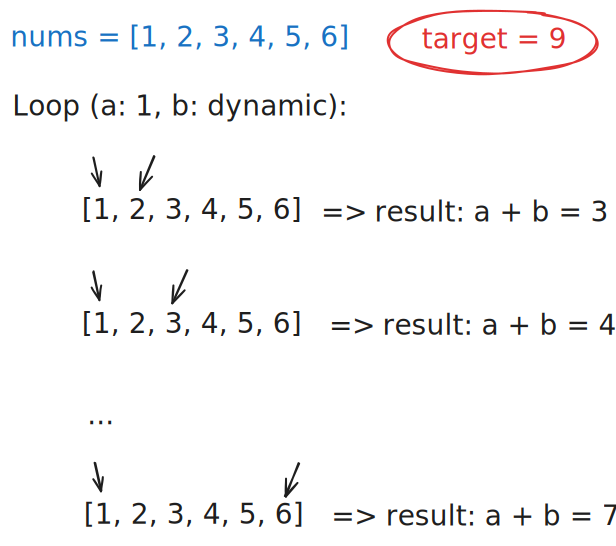
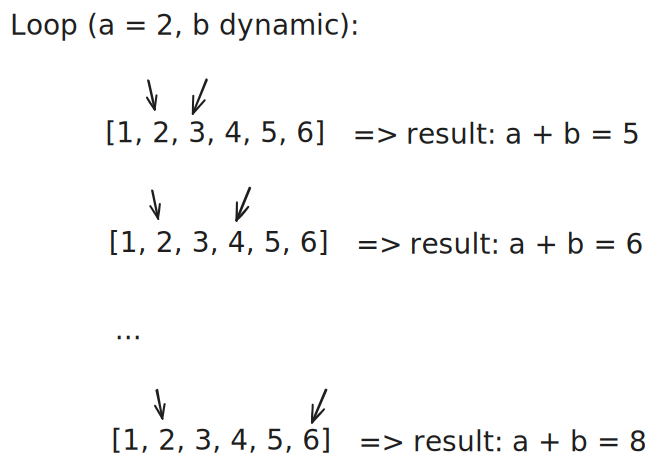
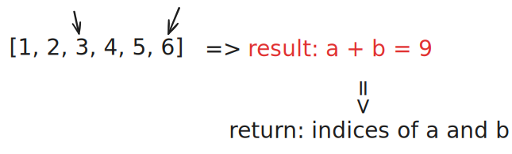

# 0001. Two Sum

## I. Problem:
Given an array of integers `nums` and an integer `target`, return _indices of the two numbers such that they add up to `target`_.

You may assume that each input would have **_exactly_ one solution**, and you may not use the same element twice.

You can return the answer in any order.

### Constraints:
- 2 <= nums.length <= 104
- -109 <= nums[i] <= 109
- -109<= target <= 109
- **Only one valid answer exists.**

## II. Examples:
### Example 1:
> **Input:** nums = [2, 7, 11, 15], target = 9  
> **Output:** [0,1]  
> **Explanation:** Because nums[0] + nums[1] == 9, we return [0, 1].

### Example 2:
> **Input:** nums = [3,2,4], target = 6  
> **Output:** [1,2]

### Example 3:
> **Input:** nums = [3,3], target = 6  
> **Output:** [0,1]

## III. Solution
- The main idea is brute-force.
- We have the first element `a`, the second element `b` and the `result` represents the sum of `a` and `b`.
- The solution includes 2 loops:
  - **Outer Loop (Iterating a):** The first loop fixes one number `a` as a candidate from the array.
  - **Inner Loop (Iterating b):** The second loop dynamically tests all subsequent numbers as candidates for `b`.
- First iteration: fix `a = 1` and loop over the remaining elements for `b`.
  

    
  

- If we can find the `result` that meets the requirement, fix `a` with it's next number (which means `a = 2`) and loop over the remaining elements for `b`.
  

    
  

- Repeat the process until the correct answer is found.
  

    
  

