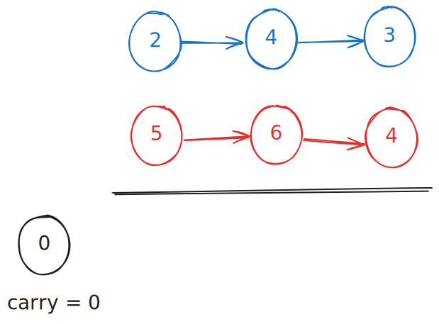
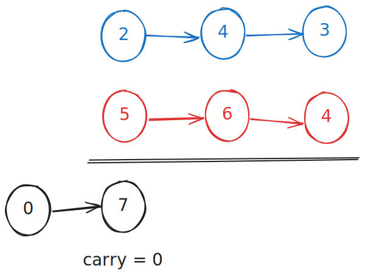
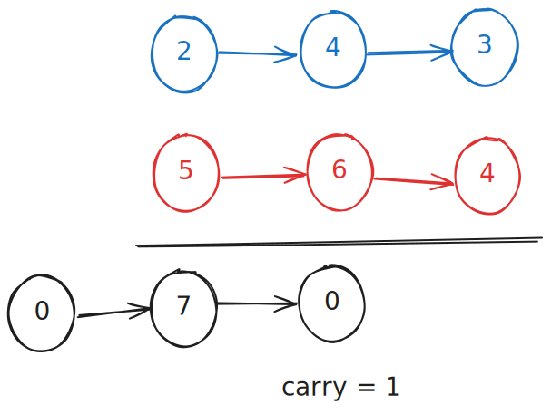
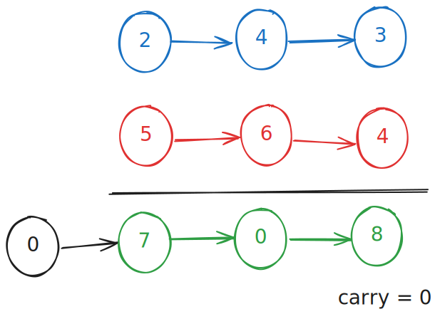
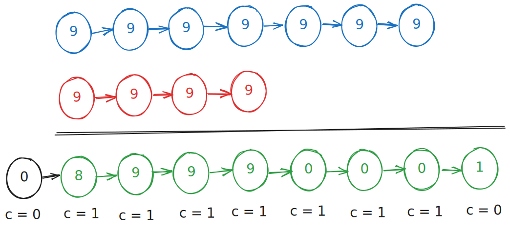

# 0002. Two Numbers

## I. Problem:
You are given two **non-empty** linked lists representing two non-negative integers. The digits are stored in **reverse order**, and each of their nodes contains a single digit. Add the two numbers and return the sum as a linked list.

You may assume the two numbers do not contain any leading zero, except the number 0 itself.

### Constraints:
- The number of nodes in each linked list is in the range `[1, 100]`.
- 0 <= Node.val <= 9
- It is guaranteed that the list represents a number that does not have leading zeros.

## II. Examples:
### Example 1:

> **Input:** l1 = [2,4,3], l2 = [5,6,4]  
> **Output:** [7,0,8]  
> **Explanation:** 342 + 465 = 807.

### Example 2:
> **Input:** l1 = [0], l2 = [0]  
> **Output:** [0]  

### Example 3:
> **Input:** l1 = [9,9,9,9,9,9,9], l2 = [9,9,9,9]  
> **Output:** [8,9,9,9,0,0,0,1]  

## III. Solution
- Firstly, create a `result_list_node` that starts with 0. Additionally, create a variable `carry` that is used to transfer a value from one column of digits to another column of more significant digits. The `carry` has value `0` when initialized.
  

    
  

- In turn, get the `sum` of `node01`'s value, `node02`'s value and `carry`.
  

    
  

- If the `sum` is greater than `10`, then the `carry` will has value `1`.
  

    
  

- The loop will end if 3 conditions are met: 
  + `l1` does not have any node left.
  + `l2` does not have any node left.
  + `carry` has the value `0`.
  

    
  

- Keep in mind that the final `result_list_node` will remove the linked list's first node, which has value `0`.
  

    
  

