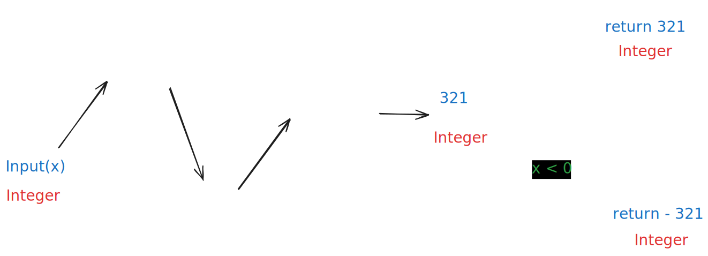

# 0007. Reverse Integer

 

## I. Problem:

Given a signed 32-bit integer `x`, return `x` with its digits reversed. If reversing `x` causes the value to go outside the signed 32-bit integer range [-231, 231 - 1], then return `0`.

**Assume the environment does not allow you to store 64-bit integers (signed or unsigned).**

### Constraints:

- -231 <= x <= 231 - 1

 

## II. Examples:

### Example 1:

> **Input:** x = 123  
> **Output:** 321  

### Example 2:

> **Input:** x = -123  
> **Output:** -321  

### Example 3:

> **Input:** x = 120  
> **Output:** 21  

 

## III. Solution

- The following steps can be used to solve this problem:
  

    
  

- At the very first, the input **Integer** is converted to its absolute value. 
- Next step, continue cnovert this absolute number to **String** type. 
- Reverse the string to get the raw `result` (**String** type).
- If the input `x` is a positive number, return `int(result)`. If negative, return `-int(result)`.
- One thing to remember, if the final `result` is out of range [-231, 231 - 1], return `0`. 
