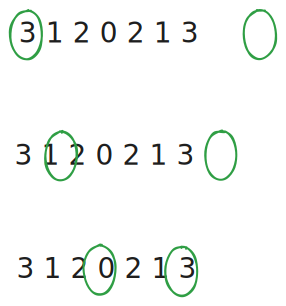
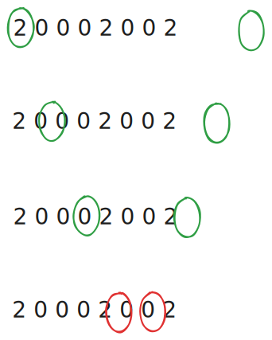

# 0009. Palindrome Number

## I. Problem:

Given an integer `x`, return `true` _if `x` is a 
**palindrome**, and `false` otherwise_.

### Constraints:

- -231 <= x <= 231 - 1

## II. Examples:

### Example 1:

> **Input:** x = 121  
> **Output:** true  
> **Explanation:** 121 reads as 121 from left to right and from right to left.

### Example 2:

> **Input:** x = -121  
> **Output:** false  
> **Explanation:** From left to right, it reads -121. From right to left, it becomes 121-. Therefore it is not a palindrome.

### Example 3:

> **Input:** x = 10  
> **Output:** false  
> **Explanation:** Reads 01 from right to left. Therefore it is not a palindrome.

## III. Solution

- We simply divide the input number into 2 symmetrical parts. In turn, we compare the numbers from front to back of the 1st part with the numbers from back to front of the 2nd part. If every pair of the comparison is the same, return `True`.
  

    
  

- If any pair of the comparison is not the same, return `False`.
  

    
  

