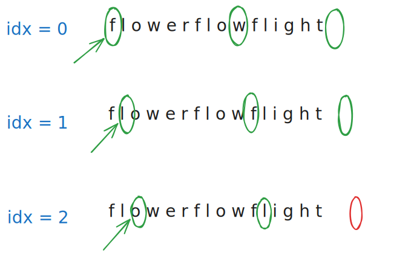

# 0014. Longest Common Prefix

 

## I. Problem:

Write a function to find the longest common prefix string amongst an array of strings.

If there is no common prefix, return an empty string "".

### Constraints:

- 1 <= strs.length <= 200
- 0 <= strs[i].length <= 200
- strs[i] consists of only lowercase English letters.

 

## II. Examples:

### Example 1:

> **Input:** strs = ["flower","flow","flight"]  
> **Output:** "fl"

### Example 2:

> **Input:** strs = ["dog","racecar","car"]  
> **Output:** ""  
> **Explanation:** There is no common prefix among the input strings.

 

## III. Solution

- We compare every character in every word. If the comparison is the same, append the character to the `result_prefix`. Otherwise, return the `result_prefix`.
  

    
  

- With this logic, if the loop is stopped at the first iteration, the `result_prefix` will return `""`.
  

    
  

